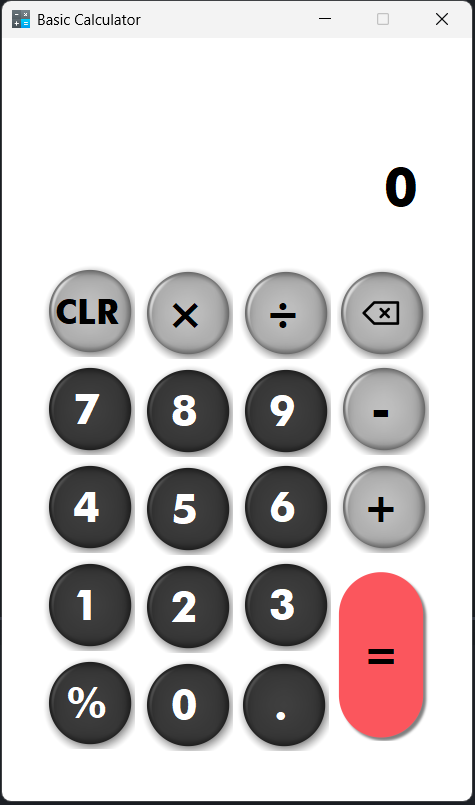
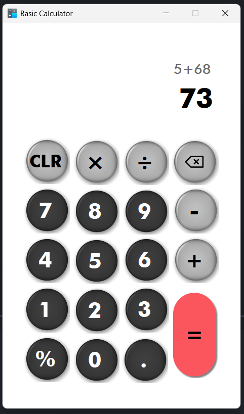

# 🧮 Basic Calculator
A clean and functional Basic Calculator built using C# and Windows Forms in Visual Studio 2022. This application supports standard arithmetic operations with a custom-styled graphical interface designed for simplicity and ease of use.

## ✨ Features

* User-friendly Interface – Custom circular buttons with shadows and color themes.

* Basic Operations – Addition, subtraction, multiplication, division, and percentage.

* Clear (CLR) Button – Resets all input and results.

* Backspace – Delete the last entered digit.

* Decimal Support – Perform operations with floating-point numbers.

* Live Expression Display – Shows current expression before calculating the result.

## 📷 Screenshot

    

## 🧰 Technologies Used
* Language: C#

* Framework: .NET Framework (Windows Forms)

* IDE: Visual Studio 2022

* UI: Custom-designed buttons and layout for a modern calculator feel

## 🖥️ Setup Instructions
To run or modify this calculator on your machine:

**Prerequisites:**

* Visual Studio 2022

* .NET Framework installed (compatible with the WinForms version used)

**Steps:**

1. Clone or Download this repository.

2. Open the Solution: Launch CalculatorLab4.sln in Visual Studio.

3. Build the Project: Press Ctrl + Shift + B or use the Build menu.

4. Run the App: Press F5 or click the Start button.

## 📁 Project Structure

    CalculatorLab4/
    ├── Properties                   # Contains project and assembly properties
    ├── Resorces                     # Contains project and assembly properties
    ├── sample_outpu                 # Sample output files
    ├── .gitignore                   # Git ignore rules
    ├── App.config                   # Application configuration settings
    ├── CalculatorLab4.csproj        # Project configuration file
    ├── CalculatorLab4.sln           # Solution file
    ├── Form1.Designer.cs            # Designer-generated UI code for the main form
    ├── Form1.cs                     # Logic and event handling for the main form
    ├── Form1.resx                   # Resources
    ├── Program.cs                   # Application entry point
    └── README.md                    # Project documentation

## 📝 Notes
The calculator uses Windows Forms for its graphical interface, making it a great starting project for learning desktop application development in C#.

The buttons are styled with shadows and distinct colors to improve user experience.

## 🧑‍💻 Team Members
| Name  | E-mail             |
|------------|-------------------------|
| Africa, Kiarra Francesca Gabrielle S. | 23-01292@g.bastate-u.edu.ph |
| Aguzar, Joel Lazernie A. | 23-00562@g.batstate-u.edu.ph |
| Garcia, Kriztel C.| 23-03726@g.batstate-u.edu.ph |
| Lacerna, James Louie | 23-05991@g.batstate-u.edu.ph |

## 🤝 Acknowledgement

We, the members of **GROUP 8**, would like to sincerely thank **Ms. Fatima Marie P. Agdon**, our Advanced Object-Oriented Programming instructor, for her guidance, support, and encouragement throughout this project. Her insights and clear explanations helped us greatly in applying advanced programming concepts effectively.
